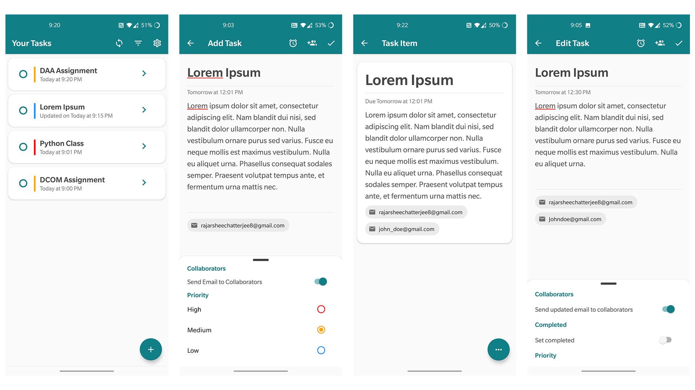

# Task Manager

[](https://expo.io/)

A cross-platform task manager application built with React Native (Expo CLI)

## Screeshots



## Features

-   [x] Signup and login with your account
-   [x] Add, Read, Edit and Delete tasks
-   [x] Sort and filter tasks as per your need
-   [x] Send emails to multiple collaborators on a task
-   [x] Works on both IOS and Android devices
-   [x] All data is stored on cloud storage
-   [x] Light and dark themes

## Get Started

#### 1. Clone the Repo

On the terminal run the following commands

```sh
$ git clone 

$ cd task-manager

$ npm  OR expo install (to install all dependencies )

$ expo start

```

